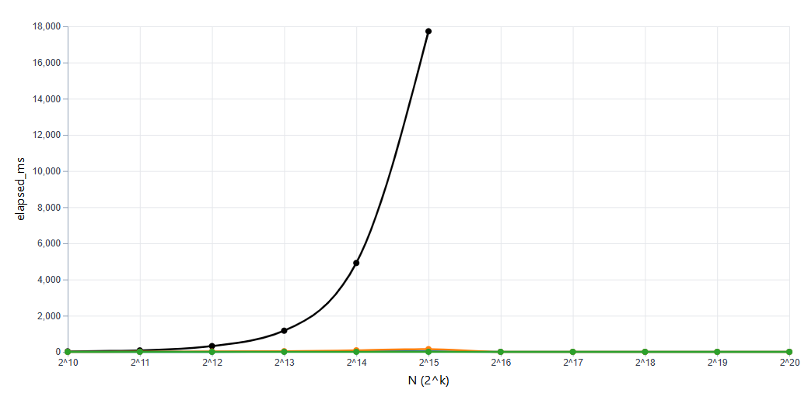

Question.

How do different implementations of the priority queue API perform on the batch-then-drain workload?
This workload is where we insert N elements into an empty queue and then extract them all in priority order.

Hypothesis.

I think the binary heap will show the best performance.
Each insert is O(log(N)) accounting for the sifting, and the batch phase requires N inserts.
So its time complexity is O(N * log(N)).
Then each extract-min is O(log(N)) accounting for the sifting again, and the drain phase requires N extract-mins.
So its time complexity is O(N * log(N)).
Therefore, the overall theoretical time complexity is O(N * log(N)).

As for the other structures,
I think the oracle will be O(N^2), because of its linear-time operations.
I think the binomial queue will have a similar outcome to the binary heap (if not exactly O(N * log(N))), but because of the way it's structured, it will be slightly slower.
Finally, I think the linear baseline will be O(N^2) but it will work great on lower values of N. After all, its insert complexity is only O(1). Yes, its extract min is O(N), but again, it should work fine on lower N's.

Method.

The Batch Then Drain's framework is the same that was introduced in the Huffman profile, designed to be able to be reproduced and have fair comparison.

As for the trace files, each of them have exactly 2N operations.
N of them are inserts, and N of them are extracts.

For key generation, I wanted uniform random integers with minimal duplicates to test the worst-case performance.
So, the range of possible integers is 1 to N^2.
The difference between this and Huffman is that Huffman used limited key ranges to make many duplicates.
This actually points out their two different use cases - Huffman models character frequency, whereas batch-then-drain models unique prioritized tasks.

The values of N that we are testing with are 13, 1024, 2048, ..., 1048576 (12 values). They are powers of 2 for clean scaling, and we have 1 trace per value of N.
Our random seed for number generation is 23, for reproducibility.
Per trace, we do 7 runs, with one of them being a warmup run.
To time them, we use std::chrono::steady_clock.

Results.

The results were not entirely what I expected, especially at higher values of N, but do tie in to my hypothesis somewhat.

Interpretation.

The ms it took for every implementation except for the oracle was incredibly low.
The oracle's spike of ms makes sense, as its time complexity is O(N^2), and it isn't built for efficiency.
However, all other implementations stayed under 2000 ms.
I'm assuming this is a characteristic of the batch-then-drain profile, with inserts and extracts being completely grouped together.

According to my hypothesis, all implementations should have at least stayed with the baseline of N in relationship with milliseconds.
However, they were all incredibly low on milliseconds at all points (except the oracle of course).
Strangely, the binomial queue had a very low spike at 2^15, and went back down after that.

I hypothesized that the linear baseline would spike dramatically at higher levels of N. Clearly I was wrong.
I also thought that binomial queue and binary heap would spike, although less dramatically, at higher levels of N. I was wrong there too.

Possible explanations I could come up with for this are that my computer is good, the pathways were exactly the same and completely warm,
something in my code or in the implementation or in the way the data got transferred to a graph is wrong, or this is the nature of batch-then-drain.